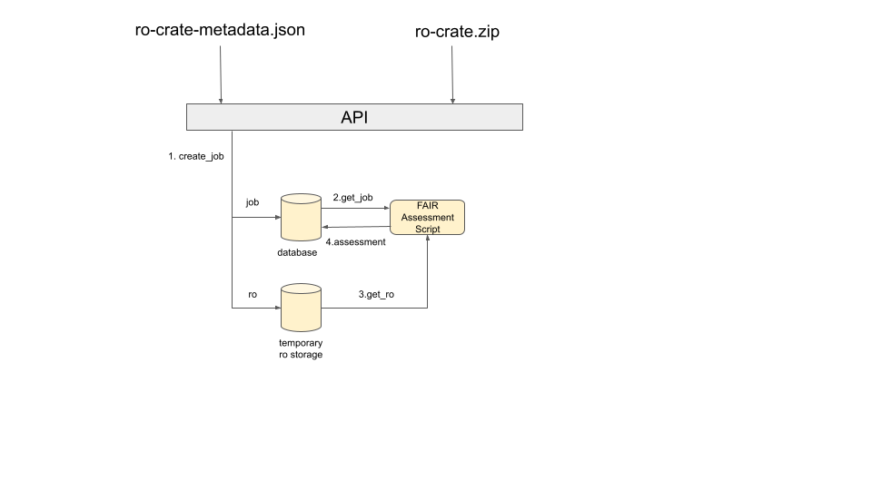

## Architecture

FAIROs is a service to assess the FAIRness of Research Objects.

The architecture of the tool is the following:



The service is composed by an API where we can find different components:

- **Dispatcher**. This component analyzes the Research Object metadata file and detects the different resources of the Research Object (datasets, software and ontologies). Once the resources are analyzed, the information is sent to the specific tool.
- **Aggregator**. This component collects the results from the tests executed and aggregates the information to calculate a FAIR score for the Research Object. Tests depend of resource's type and the FAIR principle.

We have different tools to support the assessment of the different resources of a Research Object by its nature.

For **datasets** , we have deployed in our server an instance of the application F-UJI. This application provides a REST service to assess the FAIRness of datasets based on 16 of the 17 metrics defined in the FAIRsFAIR Data Objects Assessment Metrics ([https://www.fairsfair.eu/fairsfair-data-object-assessment-metrics-request-comments](https://www.fairsfair.eu/fairsfair-data-object-assessment-metrics-request-comments)). The results of these tests are sent to the aggregator module.

For **ontologies** , we use the service provided by the Ontology Pitfall Scanner for FAIR (FOOPS!). This tool analyzes an ontology with several tests and returns a FAIRness score with an explanation of the results, categorized by each FAIR principle. The module dispatcher prepares the request and the response from FOOPS! is sent to the aggregator module.

Regarding **software** assessment, we have created a validator based on some of the FAIR software principles. In order to extract metadata associated with a given code repository, we use the Software Metadata Extraction Frame work (SOMEF), which analyzes repository documentation to retrieve the license, description, installation instructions, requirements, versions, citation text or provenance information (authors, creation date). These metadata fields are particularly relevant for reusability.

Note that in the case of the Research Objects metadata analysis, the tool F-UJI is used as well.

The process to communicate with the API is as following:

1. ROhub should create a job and the service will return a job\_id. FAIROs will process the requests.
2. ROhub will be able to check the status [PENDING, EXECUTING, FINISHED] of the job. When the assessment is finished, an assessment id will be returned.
3. ROhub will be able to access the assessment with the id.

The following figure depicts this process:


Due to the fact that processing of a request can take a while (from 10 seconds to 1 minute), we have decided to develop an infrastructure with a flow control. The following figure depicts, from the architecture point of view, the sequence of the create job request.


The create job operation will create a job entry in the database and will temporarily store the research object (if needed) in the server filesystem.

The assessment module is an script (worker) that will be executed periodically. We can deploy as many workers as we want. This module will get the pending jobs and will assess the research object based on a metric.

The job request returns a JSON format object with the following structure:

```json
{

status: "COMPLETED",

message:""

}
```

The status attribute can be COMPLETED or fail. In the case of COMPLETED, it means that the assessment has been finalized without any problem. Then, the user can check the result of the assessment with the assessment request. In the case of fail, the user can see the origin of the fail by message attribute.

To see the assessment, the user will have to use the id returned by the create job request.
